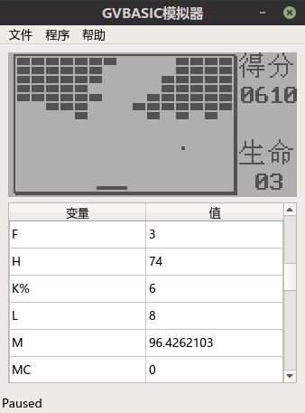

# GVBASIC模拟器
GVBASIC模拟器的C++版本。（C++14 & Qt5）

## 特性
- 支持GVBASIC所有语句和函数
- 支持嵌入6502机器码, 但未完全测试

## 构建 & 运行

构建：  

```
$ cd gui_qt
$ qmake
$ make
$ mv gui_qt .. && cd ..
```

运行：  
```
$ ./gui_qt
```

## 截图
